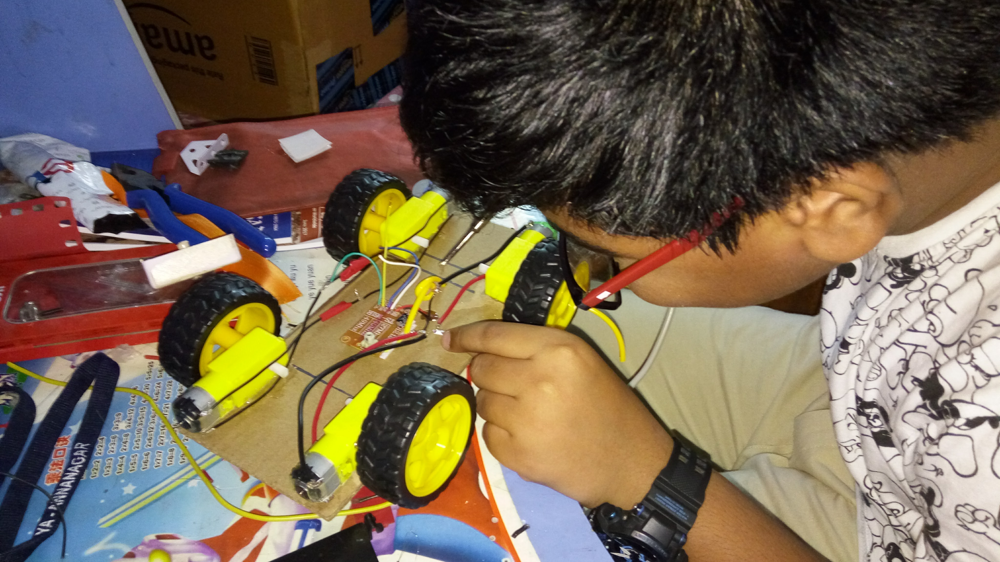
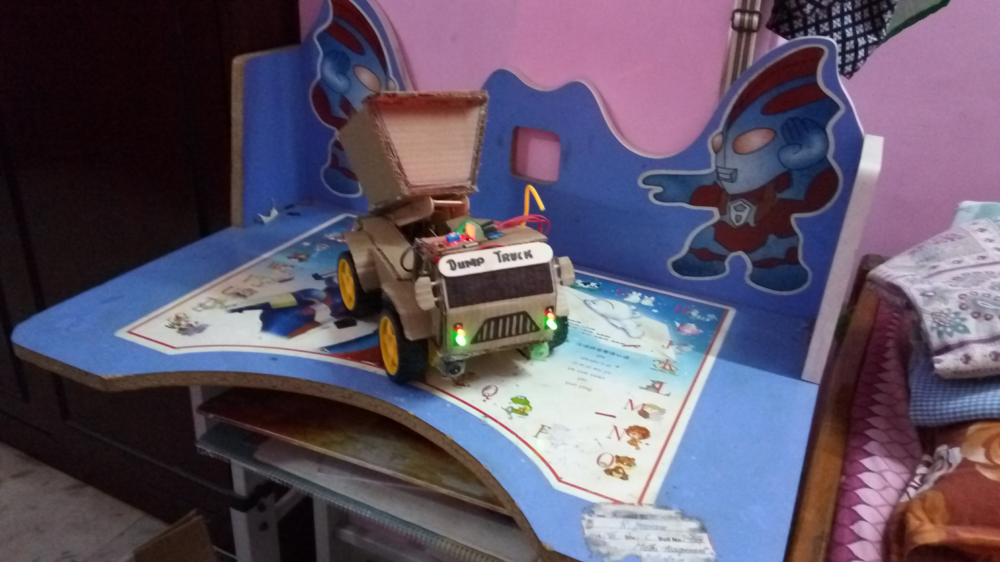
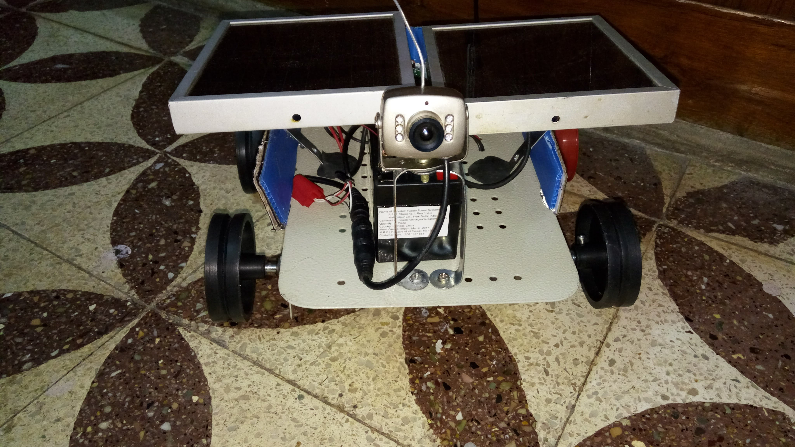
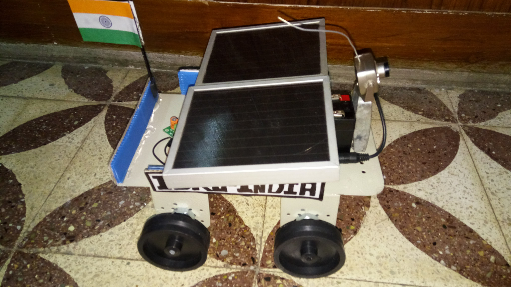

# The Vault

Here's where I'd like to keep instances of all my past projects. Back in my school days, when I started exploring the field of electronics, I didn't understand the importance of documenting things, I went through a lot of resources online for my projects, none of which I saved as far as I remember. Thankfully I've uploaded some of my really interesting projects on YouTube to my mum's channel (cuz back in the day I didn't have my own channel or mobile). "The Vault" is where I'd like to post them back and keep a record.

 

## 💻 Featured YouTube Videos

 

## 💻 My YouTube Videos

 

## 🌟 Memorable Projects

### My First Prototypes

    &nbsp;&nbsp;&nbsp;

 

As a kid, I was always interested in observing mechanical stuff around me and trying to replicate the mechanism. This led me to make prototypes. Both these are some of my initial prototypes. My prototypes had both functional as well as cosmetic parts that gave a complete look to them. The "ISRO Rover" here is an incomplete image, the completed one had threaded rubber tracks helping it to traverse difficult terrains. I presented it in the welcoming ceremony of the "<a href="https://www.thehindu.com/society/the-vahini-sandesh-of-apj-abdul-kalam-carries-a-pavillion-of-inspiring-messages-presentations-and-pictures-of-the-former-president/article19414226.ece">Kalam Sandesh Vahini</a>" before the whole school at 8th grade, live video footage from my rover camera was displayed on a television in the auditorium. I got featured in the school's annual magazine and my efforts were appreciated.

 

## Acknowledgements

 - [Awesome YouTube Cards](https://www.youtube.com/watch?v=DWFs6aqknqw)
 - [YouTube Cards Github](https://github.com/DenverCoder1/github-readme-youtube-cards?tab=readme-ov-file)
 - [SPRW Community](https://sproboticworks.com/)
